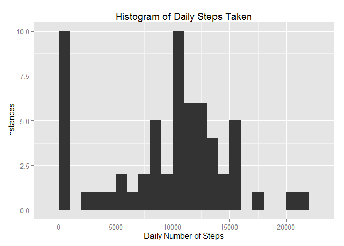
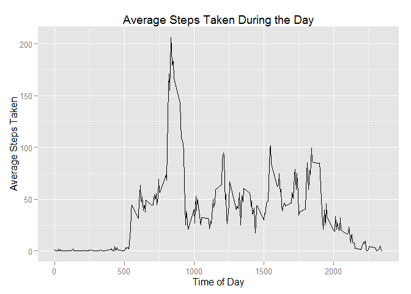
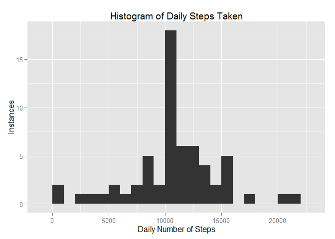
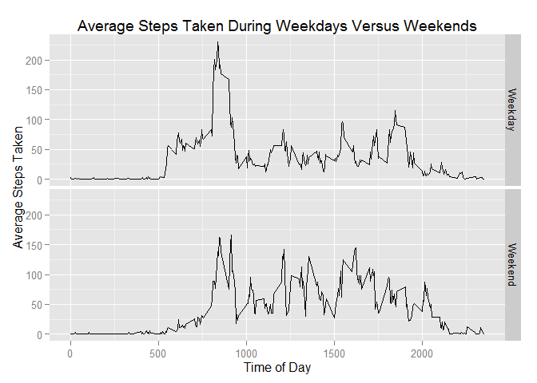

# Reproducible Research: Peer Assessment 1
Ryan Macaluso  
November 15th, 2015  

This is a document that helps to explain the questions posed in the first of the two **Reproducible Research** assignments. Each heading is one of the questions posed, and each sub-section are the components of those questions being answered.

---

## Loading and preprocessing the data

>Show any code that is needed to **load the data** (i.e. read.csv()) and **process/transform the data** (if necessary) into a format suitable for your analysis

In order to get the data processed and into memory correcty, the first thing that needs to be done is a pull from Roger Peng's GitHub repository.

- First, we need to fork the repository into our own GitHub.

- Second, we need to clone that repository into a local folder, such that we can do further work on the files. I did this by using the console entry as follows:

```
git clone https://github.com/charlesmacaluso/RepData_PeerAssessment1.git
```

From there, the repository is now housed locally. However, the files were still contained in a zipped, compressed folder, inaccessible to code we might use to pull data into memory. The next step, then, was to go about extracting those files into an **activity** folder.

Lastly, we can use the *read.csv* function to pull the data out of the file and into memory:


```r
setwd("~/R/reproducible_research/RepData_PeerAssessment1")
this_dataset <- read.csv("./activity/activity.csv")
```

There really isn't the need at this point to do further manipulation on the data frame until we know more of what the questions are going to ask, so the pull into **this_dataset** dataframe gets us through Question 1.

---

## What is mean total number of steps taken per day?

>Make a histogram of the total number of steps taken each day

Making the histogram basically requires two steps. The first of these is to create a table that aggregates all of the step data across a given day into one data point. Only then can we actually make the plot. In order to both create this table and create the chart to go along with it, we need to import a couple of libraries, **plyr** and **ggplot2**.


```r
library(plyr)
library(ggplot2)
```

Using the **plyr** package, we can create a summary table using the **ddply** function.


```r
sum_dataset <- ddply(this_dataset, .(date), summarize, sum_steps = sum(steps, na.rm = TRUE))
```

Then, using this new dataset, we can create the chart we need using the **qplot** function.


```r
qplot(sum_steps, data = sum_dataset, geom = "histogram", 
      xlab = "Daily Number of Steps", ylab = "Instances", 
      main = "Histogram of Daily Steps Taken", binwidth = 1000)
```

 

>Calculate and report the mean and median total number of steps taken per day

Doing this part just requires a simple reference back to the **sum_dataset** variable we just created. Doing **mean** and **median** calculations on this data frame help give us the necessary values.


```r
mean(sum_dataset$sum_steps)
```

```
## [1] 9354.23
```

```r
median(sum_dataset$sum_steps)
```

```
## [1] 10395
```

---

## What is the average daily activity pattern?

>Make a time series plot (i.e. type = "l") of the 5-minute interval (x-axis) and the average number of steps taken, averaged across all days (y-axis)

We're not going to be able to use the same summary dataset we created earlier. This time, we're looking at the intervals (the time of day) instead of the total day's steps. We can go about creating the data set in the same manner, though. Using the **ddply** function, we can come up with the following table:


```r
interval_dataset <- ddply(this_dataset, .(interval), summarize, mean_steps = mean(steps, na.rm = TRUE))
```

Then, we can do a similar **qplot** function on this dataframe that we did in the first question.


```r
qplot(interval, mean_steps, data = interval_dataset, geom = "line", 
      xlab = "Time of Day", ylab = "Average Steps Taken", 
      main = "Average Steps Taken During the Day")
```

 

>Which 5-minute interval, on average across all the days in the dataset, contains the maximum number of steps?

To answer this, let's subset the **interval_dataset** we created by the max values of the **mean_steps** variable.


```r
interval_dataset[interval_dataset$mean_steps == 
                     max(interval_dataset$mean_steps),]
```

```
##     interval mean_steps
## 104      835   206.1698
```

This shows the **835** interval being the most heavily walked across all days.

---

## Imputing missing values

>Calculate and report the total number of missing values in the dataset (i.e. the total number of rows with NAs)

Doing a quick summary on the initial dataset pull, we can come up with the number of missing values in the set (>2,300).


```r
summary(this_dataset$steps)
```

```
##    Min. 1st Qu.  Median    Mean 3rd Qu.    Max.    NA's 
##    0.00    0.00    0.00   37.38   12.00  806.00    2304
```

>Devise a strategy for filling in all of the missing values in the dataset. The strategy does not need to be sophisticated. For example, you could use the mean/median for that day, or the mean for that 5-minute interval, etc.

The second of those two options sounds better to me. Rather than looking for the median or mean of a given day, it's more likely that you're walking the same amount during the same time of day, regardless of the day.

>Create a new dataset that is equal to the original dataset but with the missing data filled in.

In order to actually implement that strategy, let's create a new dataframe, based upon the initial pull, and then append the **steps** column where there is missing data. Using the **interval_dataset** created earlier, we can link the interval with missing data back to a *master* version of the data, and use that reference point to fill in the missing data.


```r
clean_dataset <- this_dataset
for(i in 1:nrow(clean_dataset)) {
    if(is.na(clean_dataset[i,"steps"])) {
        clean_dataset[i, "steps"] <-
            interval_dataset[interval_dataset$interval == 
                                 clean_dataset[i, "interval"],"mean_steps"]
    }
}
```

>Make a histogram of the total number of steps taken each day and calculate and report the mean and median total number of steps taken per day. Do these values differ from the estimates from the first part of the assignment? What is the impact of imputing missing data on the estimates of the total daily number of steps?

First, we need to create a clean version of the **sum_dataset** data frame we created earlier. We'll basically use the same **ddply** function, but we reference the **clean_dataset** instead.


```r
sum_dataset_2 <- ddply(clean_dataset, .(date), summarize,
                     sum_steps = sum(steps, na.rm = TRUE))
```

Then, similarly, we re-create the histogram from earlier, but point the formulas to the new dataset we just created.


```r
qplot(sum_steps, data = sum_dataset_2, geom = "histogram", 
      xlab = "Daily Number of Steps", ylab = "Instances", 
      main = "Histogram of Daily Steps Taken", binwidth = 1000)
```

 

After we create the chart, we need some quick summaries of the data to compare against the previous version we did.


```r
summary(sum_dataset$sum_steps); summary(sum_dataset_2$sum_steps)
```

```
##    Min. 1st Qu.  Median    Mean 3rd Qu.    Max. 
##       0    6778   10400    9354   12810   21190
```

```
##    Min. 1st Qu.  Median    Mean 3rd Qu.    Max. 
##      41    9819   10770   10770   12810   21190
```

Comparatively, the newer dataset has both a higher mean and median value for the number of steps taken during the day, which makes general sense. If we were ignoring values earlier and are now including them in daily summations, the daily totals will be higher across the board.

---

## Are there differences in activity patterns between weekdays and weekends?

>Create a new factor variable in the dataset with two levels -- "weekday" and "weekend" indicating whether a given date is a weekday or weekend day.

First, we need to create a slot in the **clean_dataset** dataframe to house information as to whether that row pertains to a *weekday* or a *weekend*. As well, in order for the **weekdays** function to work, we need to convert the values in the **date** column of the **clean_dataset** to a proper date data type using the **as.POSIX** function.


```r
clean_dataset$day_type <- 0
clean_dataset$date <- as.POSIXct(clean_dataset$date)
```

Then, using the **weekdays** function, we can input whether each row is a *weekday* or a *weekend*.


```r
for(i in 1:nrow(clean_dataset)) {
    if(weekdays(clean_dataset[i, "date"]) == "Saturday" |
       weekdays(clean_dataset[i, "date"]) == "Sunday") {
        clean_dataset[i, "day_type"] <- "Weekend"
    } else {
        clean_dataset[i, "day_type"] <- "Weekday"
    }
}
```

>Make a panel plot containing a time series plot (i.e. type = "l") of the 5-minute interval (x-axis) and the average number of steps taken, averaged across all weekday days or weekend days (y-axis).

To do this, we need to create a summary data frame using the same **ddply** function we've been using throughout this exercise.


```r
interval_dataset_2 <- ddply(clean_dataset, .(interval, day_type), summarize,
                       mean_steps = mean(steps, na.rm = TRUE))
```

Then, using that newly created data set, we can create a new plot, faceting *weekdays* and *weekends* against each other to be able to better compare them to each other.


```r
qplot(interval, mean_steps, data = interval_dataset_2, geom = "line", 
      xlab = "Time of Day", ylab = "Average Steps Taken", 
      main = "Average Steps Taken During Weekdays Versus Weekends",
      facets = day_type ~ .)
```

 

This shows some interesting relationships. The weekday data points show higher traffic times typically centered around early morning and commutes, but greater activity during the middle of the day on the weekends. To see the net effect of these, let's do the sum of the steps taken across both weekday days and weekend days.


```r
sum(interval_dataset_2[interval_dataset_2$day_type == "Weekday","mean_steps"])
```

```
## [1] 10255.85
```

```r
sum(interval_dataset_2[interval_dataset_2$day_type == "Weekend","mean_steps"])
```

```
## [1] 12201.52
```

That ends up showing that, on average, despite periods of less walking occurring early on in the day and commuting hours, more overall walking takes place on weekend days than on weekday days.


